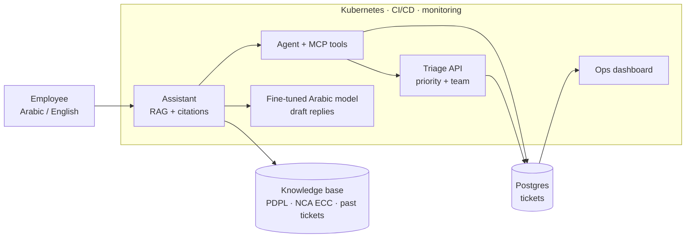

# HelpDesk AI

**An AI service desk for Saudi organisations, built end to end in public.**

Employees ask IT and policy questions in Arabic or English. HelpDesk AI predicts each ticket's priority, routes it to the right team, answers from company policies and past solutions **with citations (or says "I don't know")**, opens tickets through an agent and an MCP server, drafts replies with a fine-tuned Arabic model, and runs on Kubernetes with CI/CD and monitoring.

📄 **Product requirements:** [docs/PRD.md](docs/PRD.md)

## The problem

- Employees wait hours for simple IT and policy answers.
- Help-desk agents sort and route every ticket by hand.
- Answers about data-protection (PDPL) and cybersecurity (NCA) rules are inconsistent and unsourced.

## Architecture (target)

## Roadmap

| Release | Week | Module | Status |
|---|---|---|---|
| v0.1 | 4 | Ticket data pipeline + ops dashboard (Docker, CI, Azure) | 🔜 |
| v0.2 | 9 | Priority prediction (triage API) | ⏳ |
| v0.3 | 12 | Transformer team router | ⏳ |
| v1.0 | 22 | Knowledge assistant: RAG + agent + MCP | ⏳ |
| v1.5 | 28 | Fine-tuned Arabic reply model | ⏳ |
| v2.0 | 31 | Whole system on Kubernetes | ⏳ |

## Repository layout

| Folder | What goes there |
|---|---|
| `data/` | Ingestion and cleaning pipeline |
| `dashboard/` | Streamlit ops dashboard |
| `triage/` | Priority model and team router (FastAPI) |
| `assistant/` | RAG, evaluation, agent |
| `mcp_server/` | MCP server exposing the product's tools |
| `llm/` | Fine-tuning dataset, training, serving |
| `deploy/` | Helm chart and Kubernetes manifests |
| `docs/` | PRD, design decisions (ADRs), security and release docs |

## Progress

I post weekly updates on LinkedIn: *Building HelpDesk AI in public · Week N/34*. Learning notes live in [ai-engineering-log](https://github.com/ashraf2k/ai-engineering-log).
